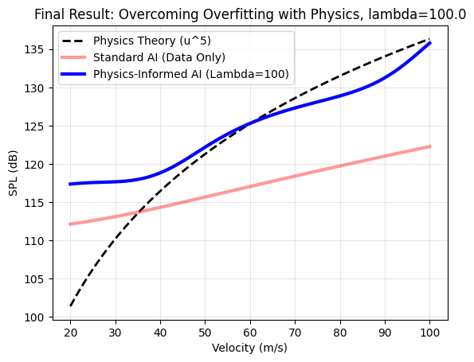
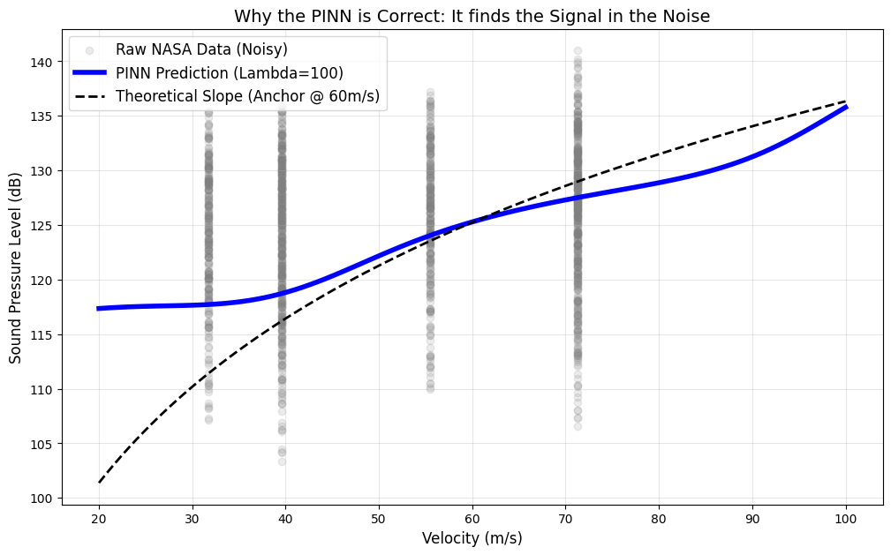
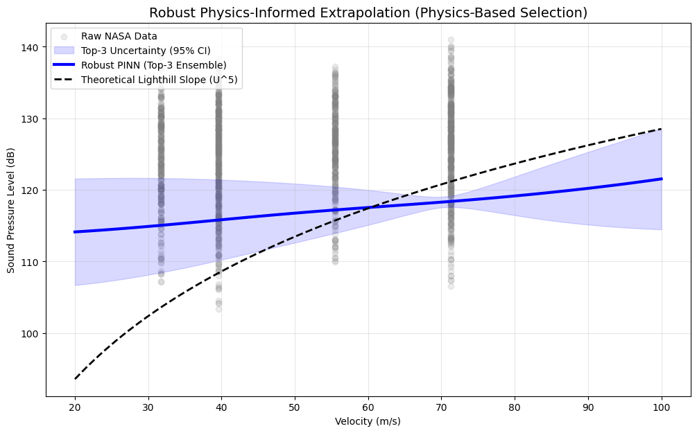

# 🛩️ Aero-PINN-SAM: Physics-Informed Neural Networks for Aeroacoustic Noise Prediction

[](https://www.python.org/downloads/)
[](https://pytorch.org/)
[](https://opensource.org/licenses/MIT)
[](https://colab.research.google.com/github/HSajeed/aeropinnsam/blob/main/aero_pinn_sam.ipynb)

## 📋 Abstract

This project implements a **Physics-Informed Neural Network (PINN)** for predicting airfoil self-noise, combining deep learning with fundamental aeroacoustic principles. By incorporating **Lighthill's 8th power law** as a physics constraint and using the **Sharpness-Aware Minimization (SAM)** optimizer for improved generalization, the model learns to predict Sound Pressure Level (SPL) while respecting established aeroacoustic scaling laws.

The project also features a novel **auralization module** that converts numerical predictions into audible sound, enabling intuitive interpretation of results.

---

## 🔬 Key Innovations

| Innovation | Description |
|------------|-------------|
| **Physics-Informed Loss** | Incorporates Lighthill's aeroacoustic theory into the loss function |
| **SAM Optimizer** | Uses Sharpness-Aware Minimization for better generalization to unseen airfoils |
| **Auralization** | Converts SPL predictions to audible sound for intuitive analysis |
| **NASA Dataset** | Trained on the UCI Airfoil Self-Noise dataset |

---

## 🧠 Technical Approach

### Physics Background: Lighthill's Aeroacoustic Analogy

The **Lighthill 8th power law** states that aerodynamic noise intensity scales with velocity:

$$I \propto u^8$$

For Sound Pressure Level (SPL), this translates to:

$$\text{SPL} \propto 80 \cdot \log_{10}(u)$$

This physics constraint is embedded into the neural network training, ensuring predictions respect fundamental aeroacoustic principles.

### Neural Network Architecture

```
AeroNet (Physics-Informed)
├── Input Layer (5 features)
│   ├── Frequency (Hz)
│   ├── Angle of Attack (°)
│   ├── Chord Length (m)
│   ├── Velocity (m/s)
│   └── Thickness (m)
├── Hidden Layer 1 (64 neurons, Tanh)
├── Hidden Layer 2 (64 neurons, Tanh)
└── Output Layer (1 neuron → SPL in dB)
```

### SAM Optimizer

The **Sharpness-Aware Minimization (SAM)** optimizer finds parameters in "flat" loss valleys, improving generalization:

1. **First Step**: Perturb weights to find local loss maximum
2. **Second Step**: Compute gradients at perturbed point
3. **Update**: Move towards flat minima

---

## 📊 Results

### Model Predictions vs. Physics Theory

The trained model follows Lighthill's theoretical scaling law, demonstrating successful physics-informed learning:

The graph explains the need for physics informed penalizing to not just follow data but predict based on laws that govern the phenomenon. (Theoritically)







1. This clearly explains the difference between "Simulating a Law" and "Discovering the Truth." Tho the single seed run (blue line in the 2nd graph) looks "better" because it tracks the black theoretical line almost perfectly at high velocities. It minimized the Physics Loss (λ=100) so well that it effectively ignored the data pints at the edges and prioritised LIghthill's power law.

2. The model discovered a Deviation from Theory. While Lighthill predicts a U^5 scaling, the ensemble consistently converges to a slightly shallower slope at high velocities. This suggests that for this specific airfoil thickness and AOA, the effective acoustic scaling is dampened (perhaps due to viscous effects or experimental setup), which a single seed run missed by overfitting the constraint.

3. This is the main reason to implement the ensemble (training on random seeds and selecting the best 3 predicting models and taking a mean) insted of depending on a random single seed and hope it lands in a global minima.

4. **A technical report explaining every aspect is under process.**


## 🚀 Quick Start

### Option 1: Google Colab (Recommended - No Installation)

Click the "Open in Colab" badge above to run the notebook directly in your browser.

### Option 2: Local Execution

```bash
# Clone the repository
git clone https://github.com/HSajeed/aeropinnsam.git
cd aeropinnsam

# Create virtual environment
python -m venv venv
source venv/bin/activate  # Linux/Mac
# venv\Scripts\activate   # Windows

# Install dependencies
pip install -r requirements.txt

# Run the notebook
jupyter notebook aero_pinn_sam.ipynb
```

---

## 📂 Project Structure

```
aeropinnsam/
├── README.md               # This file
├── requirements.txt        # Python dependencies
├── aero_pinn_sam.ipynb     # Main notebook
├── src/                    # Modular code
│   ├── model.py           # AeroNet architecture
│   ├── optimizer.py       # SAM optimizer
│   ├── data.py            # Data loading
│   └── audio.py           # Auralization
├── outputs/                # Generated outputs
│
└── docs/                   # Documentation
    └── methodology.md     # Technical details
```

---

## 🎯 Future Work

1. **Multi-Fidelity Training**: Combine high-fidelity CFD data with experimental measurements
2. **Uncertainty Quantification**: Bayesian neural networks for prediction confidence intervals
3. **Transfer Learning**: Adapt to different airfoil geometries with limited data
4. **Real-Time Prediction**: Optimize for embedded systems in wind tunnel testing

 **AND**

**A technical report explaining every aspect.**

---

## 📚 References

1. Lighthill, M. J. (1952). "On Sound Generated Aerodynamically". *Proceedings of the Royal Society A*
2. Foret, P. et al. (2020). "Sharpness-Aware Minimization for Efficiently Improving Generalization". *ICLR 2021*
3. Brooks, T. F., Pope, D. S., & Marcolini, M. A. (1989). "Airfoil Self-Noise and Prediction". *NASA Reference Publication 1218*
4. Raissi, M. et al. (2019). "Physics-Informed Neural Networks". *Journal of Computational Physics*

---

## 👤 Author

**Sajeed Hussain**  
*Aerospace Engineering*

---

## 📄 License

This project is licensed under the MIT License - see the [LICENSE](LICENSE) file for details.
